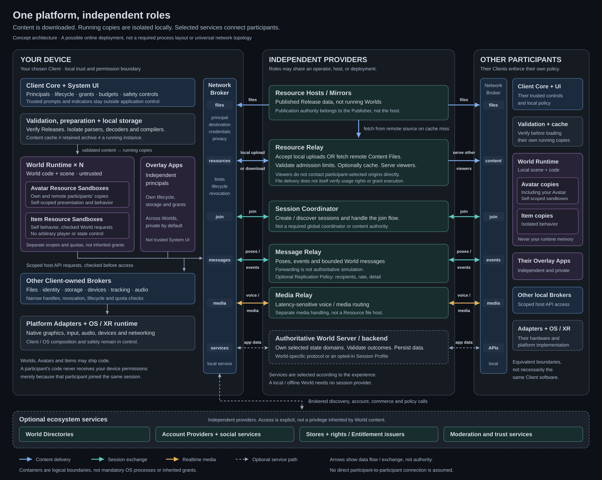

# Architecture Overview

[Home](./README.md) · [Concept](./Start%20Here.md) · [Glossary](./Reference/Glossary.md)

> The platform connects independently built Clients, portable Resources, and independently operated services. It is a family of compatible contracts, not one server or one universal network protocol.

## The Whole System in Brief

- **The Client runs on the user's device.** It loads content, renders it, runs isolated code, and controls access to local data and hardware.
- **Worlds, Avatars, Items, and Overlay Apps are Resources.** They are published as data and code. A Client creates running copies from them.
- **Providers supply particular services.** Hosting files, managing accounts, forwarding messages, and validating game state are different jobs. One operator may provide several, or a deployment may combine independent operators.
- **Other participants have their own Clients.** They run their own copies and exchange permitted data, not shared memory or unrestricted control of another device.
- **Only the needed services participate.** A local World needs no remote services. An online experience declares the services and interfaces on which it depends.

## System Map

[Open the SVG at full size.](./Reference/Diagrams/metaverse-architecture.svg)

The diagram shows a representative relayed online deployment, not a mandatory configuration. Connections represent communication, not a grant of authority. Boxes are logical roles or isolation boundaries, not a required number of machines or operating-system processes. Optional account, search, commerce, and moderation roles are not prerequisites for opening a local World.

Direct host-to-Client arrows show ordinary publication retrieval, such as opening a World. Participant-supplied Avatars and Items follow the Resource Relay path in this example. Internal Client wiring and provider-to-provider federation are simplified. The tables identify the corresponding responsibilities.

The tables below are the text equivalent and explain responsibilities hidden by the compact diagram.

## What “Independent” Means

There are three different kinds of building block:

| Kind | Examples | Meaning of independence |
| --- | --- | --- |
| **Portable content and data** | World, Avatar, Item, Release, Manifest | Can be produced, stored, and delivered without being tied to one Client or host, subject to supported formats and access rules |
| **Local execution roles** | World Runtime, Resource Sandbox, brokers | Have distinct responsibilities and authority boundaries. Their implementation and process layout may vary |
| **Network service roles** | Account Provider, Resource Relay, Authoritative World Server | Can be implemented or operated separately when they support the contract the caller uses |

Independence does **not** mean “no dependencies.” A World still needs compatible Client interfaces. An online session may require a particular authority service. It means those dependencies are explicit contracts rather than hidden assumptions about one vendor's implementation.

It also does not promise a universal plug-in ABI for every internal Client component. The standard defines observable behavior at portable-content and service boundaries. A Client author may organize internal modules differently. An implementation module, an operator, and a protocol role are not interchangeable concepts.

## 1. Portable Content: What Gets Opened

All four initial Resource Types use the same [publication and Release model](./Concepts/Resource%20Model.md). They differ in how they are instantiated and what their behavior may affect.

| Resource | Running form | Relationship to other components |
| --- | --- | --- |
| **[World](./Concepts/Worlds%20and%20Sessions.md)** | World Runtime inside a Client | Supplies the scene and application behavior and may integrate Resources and connect to declared services |
| **[Avatar](./Concepts/Avatars.md)** | Resource Instance inside a World | Represents one World Presence. Behavior is confined to Resource Sandboxes and approved integration interfaces |
| **[Item](./Concepts/Items%20and%20Ownership.md)** | Resource Instance inside a World | Can be fixed, dynamically loaded, held, or attached under the World's rules. Movement and inventory are optional. It cannot independently control another participant |
| **[Overlay App](./Concepts/Overlay%20Apps.md)** | Independent sandboxed application alongside Worlds | Has its own principal, lifecycle, storage, and grants and uses approved interfaces to interact with a World |

A Release contains a Manifest and hash-bound Content Files. These are **data**, not additional running services. One Release can produce many runtime instances on many devices. Hosting a World package does not execute its scripts on the host.

A World Address locates a publication. A Publication Record identifies its current Release. A Session Descriptor describes a particular online session and its services. None is itself a server. [Collections](./Concepts/Collections%20and%20Sharing.md) and Profiles are personal data models, not execution modules or hosting services.

## 2. The Client: What Runs Locally

These responsibilities are separated for security and implementation clarity. Their detailed rules belong to [Client and Runtime](./Client%20Platform/Client%20and%20Runtime.md), not to this overview.

| Local role | Owns or does | Boundary |
| --- | --- | --- |
| **Client Core and System UI** | Lifecycle, principals, budgets, permission decisions, navigation, trusted indicators, and emergency controls | Downloaded content cannot impersonate or replace the trusted controls |
| **Content loading and preparation** | Resolves publications, checks Manifests, selects compatible files, verifies content, and prepares it for use | Retrieval and validation work before World code. Untrusted parsing and compilation are isolated, not automatically part of the Core |
| **World Runtime** | Runs one World's application and local scene | Cannot directly access another World's memory, credentials, or storage |
| **Resource Sandboxes** | Run Avatar and Item behavior within a World's runtime context | Separate principals, budgets, and self-scoped handles. Containment does not imply permission inheritance |
| **Overlay App runtime** | Runs user-installed cross-World tools | A separate application principal, not a child inheriting access from the foreground World |
| **Brokers** | Mediate network, files, identity, storage, media capture, and device operations | Check the calling principal, destination, approved scope, and budget and return narrow handles rather than ambient access |
| **[External App Bridge](./Client%20Platform/Software%20Integration.md)** | Connects user-paired external programs to approved Client functions or specific application interfaces | A separate software integration role. Pairing grants neither hardware access nor unrestricted World control |
| **Rendering, audio, and platform/device integration** | Present approved output and adapt OS, graphics, XR, and device interfaces | Local Features and Limits remain explicit. Untrusted code does not gain native driver access |
| **Local storage services** | Keep caches, scoped application data, local Profile data, and user-retained files | Cache eviction, persistent application storage, and a retained Portable Archive have different lifecycles |

The same pattern applies to desktop, mobile, and XR devices. A System Client may also be the device's shell, but Worlds do not acquire operating-system privileges as a result. An AR experience remains a World using optional interfaces through these same boundaries.

Physical peripherals enter through [Device Adapters and the Device Broker](./Client%20Platform/Devices%20and%20Input.md). External Apps run outside the Client and cross the separate Bridge boundary, locally or over an explicitly enabled network. These optional connections are omitted from the compact system map. They do not introduce another mandatory provider or turn external programs into installed Resources.

A World may compose fixed or dynamic Items from several publishers without a new universal composition service. The developer owns discovery and arrangement, while the Client retains validation and sandbox boundaries. User-controlled applications with independent lifecycles use Overlay Apps instead.

### Where another person's Avatar runs

The other Client announces an Avatar Release and permitted runtime updates. **Your Client** obtains and validates the files, then renders the Avatar and runs any supported presentation behavior in **your local Resource Sandbox**. Your own Avatar may likewise have an instance on every viewing Client.

An incoming pose or Item interaction is data to validate, not permission for a peer to execute arbitrary commands. Resource Behavior reaches shared World state only through the World's checked interfaces and the authority assigned to that state. Local Permissions do not grant power over another player's position or inventory.

Several World Runtimes and World Presences may coexist when the Client supports them. There is no required global active Avatar, shared permission context, or automatic microphone broadcast to every open World. See [Client and Runtime: Multi-World Lifecycle](./Client%20Platform/Client%20and%20Runtime.md).

## 3. Provider Roles: What Can Run Remotely

“Remote” means outside the participant's local application boundary. A provider may run in a cloud, on a community server, or on someone's own computer. Hosting location does not change the role's authority.

### Publication, discovery, and personal services

| Role | Responsibility | Main relationship and optionality |
| --- | --- | --- |
| **Publisher** | Controls a Resource's publication updates and signs its publication records | Authoring/publishing tools produce verified data for Clients. This is an authority, not necessarily an always-online server |
| **Resource Host / Mirror** | Serves metadata and immutable Content Files | Client loaders or Resource Relays retrieve files. An already available local Release needs no remote host. A Mirror does not become the Publisher |
| **World Directory** | Searches and presents World Addresses and permitted listing information | Client navigation queries it. Direct addresses work without it. It does not decide World identity or admission |
| **Account Provider** | Authenticates users and supplies supported account, Profile, synchronization, and recovery operations | Trusted Client account interfaces use it. Local Profiles and guest use do not require one |
| **Social and Collection services** | Friends, permitted presence, personal messages, Invitations, saved references, and audiences | Client platform interfaces and compatible providers exchange these records. These roles may be combined with the Account Provider |

Personal messaging between accounts is **not** the World Message Relay. Friends and Invitations can work without both people being in the same World. Federation needs provider-to-provider contracts as well as Client-facing APIs. This separation does not yet settle their exact discovery or authentication mechanisms.

Publication and retrieval rules belong to [Publishing and Delivery](./Concepts/Publishing%20and%20Delivery.md). Account, social, and saved-data semantics belong to [Identity and Profiles](./Concepts/Identity%20and%20Profiles.md) and [Collections and Sharing](./Concepts/Collections%20and%20Sharing.md). Shared bootstrap contracts belong to [Platform Services](./Concepts/Platform%20Services.md).

### Session services

| Role | Responsibility | Not implied by this role |
| --- | --- | --- |
| **Session Coordinator** | Finds or creates session instances and handles the join flow under admission rules | Does not automatically relay every packet or simulate the World |
| **[Message Relay](./Concepts/Message%20Relay.md)** | Forwards bounded poses, events, and application messages to allowed recipients | Forwarding or ordering a message does not make its gameplay claim correct |
| **[Resource Relay](./Concepts/Resource%20Relay.md)** | Fetches participant Resources from hosts or accepts client uploads, optionally caches them, and serves viewers indirectly | Does not execute their behavior or act as a compulsory copyright authority |
| **Media Relay** | Routes latency-sensitive voice or other realtime media | Cannot grant microphone permission or silently turn on capture |
| **Authoritative World Server** | Validates and owns explicitly assigned shared state domains | Does not automatically own every part of the World or local Client state |
| **Other World Services** | Provide application-specific persistence, business logic, or integrations | Do not receive unrestricted local access merely because the World uses them |

A Session Service Provider is the **operator** of one or more roles above, not an additional required routing layer. The deployment selects the roles it needs. Multiple sessions of one World may use different providers, endpoints, or regions.

For an optional shared Session Profile, the Session Descriptor names the participating roles and contracts. A custom World backend can define its own application protocol through [brokered networking](./Client%20Platform/Networking.md), while keeping the platform's privacy and security boundaries. Neither approach requires every service in the table.

### Optional ecosystem roles

- **Stores, payment providers, rights issuers, and verifiers** handle different parts of commerce. A purchase, an Entitlement, file possession, and permission to use a Resource are not the same thing. See [Commerce and Usage Rights](./Concepts/Commerce%20and%20Usage%20Rights.md).
- **Moderation and community services** supply reports, labels, or policy decisions. A subscribing Client or service applies the policy within its own authority. No feed becomes an ecosystem-wide administrator. See [Safety and Moderation](./Trust/Safety%20and%20Moderation.md).

These roles may use independently hosted services, but basic Resource loading does not require a store, commercial certificate, or moderation provider.

## 4. What Talks to What

Communication falls into a few separate contract families. Sharing a transport or physical server does not merge their responsibilities.

| Boundary | What crosses it | Contract owner |
| --- | --- | --- |
| Client ↔ publication source | Addresses, publication metadata, Manifests, selected Content Files | [Publishing and Delivery](./Concepts/Publishing%20and%20Delivery.md), [Resource Model](./Concepts/Resource%20Model.md) |
| Sandboxed application ↔ Client host interfaces | Typed operations, approved handles, events, and bounded data | [Client and Runtime](./Client%20Platform/Client%20and%20Runtime.md), [Features and Permissions](./Client%20Platform/Features%20and%20Permissions.md), [Networking](./Client%20Platform/Networking.md) |
| Avatar/Item behavior ↔ World integration | Self-scoped updates and checked interaction intents | [Worlds and Sessions: Nested Resource Behavior](./Concepts/Worlds%20and%20Sessions.md), [Items and Ownership](./Concepts/Items%20and%20Ownership.md) |
| Client ↔ platform providers and provider ↔ provider | Search, account and social operations, saved-data synchronization | [Platform Services](./Concepts/Platform%20Services.md), [Identity and Profiles](./Concepts/Identity%20and%20Profiles.md) |
| Session participants ↔ session services | Join/admission, messages, media, content delivery, and state updates, in separate roles | [Worlds and Sessions](./Concepts/Worlds%20and%20Sessions.md), [Message Relay](./Concepts/Message%20Relay.md), [Resource Relay](./Concepts/Resource%20Relay.md) |
| World application ↔ its backend | Developer-defined application data and validated state changes | Declared application contract over [Networking](./Client%20Platform/Networking.md) |

Exact schemas, API versions, codecs, and wire bindings are still unfinished. This table identifies where those contracts belong. It does not claim that arbitrary existing implementations already interoperate.

### Example: two people meet in a World

1. Each Client opens and validates the World Release through its own loader. Search and account services participate only if used.
2. A supported join flow connects each participant to the same session. Admission identifies the approved endpoints and the authority for relevant state.
3. Each participant announces the Avatar for that World Presence. The Resource Relay obtains missing files from a host or an authorized owner's upload. Viewers may reuse their verified local cache.
4. Each viewer validates and instantiates the Avatar locally. Resource code stays in its own sandbox, even when another participant supplied it.
5. Poses and events use the selected message path. Voice uses the selected media path. An authoritative server, if present, validates its assigned state rather than trusting a relay to prove correctness.
6. Each Client applies its own rendering, permission, safety, and fallback policies. Optional social presence sharing happens separately from in-session replication.

The privacy-oriented path does not require viewers to connect to another participant's device or arbitrary personal host. Relays still observe network and timing metadata. They are not a promise of anonymity. Failure does not silently enable direct-peer or direct-origin connections. See [Resource Relay: Privacy and Trust](./Concepts/Resource%20Relay.md) and [Networking](./Client%20Platform/Networking.md).

## 5. There Is No Single “Orchestrator”

Use the name of the actual responsibility:

- **Client Core:** which local Worlds run, receive focus, or are suspended.
- **Session Coordinator:** which shared session to join and how admission works.
- **Replication Policy:** who receives allowed updates, at what rate and supported detail level. This can be a replaceable module inside a relay or backend, not another mandatory server.
- **Authoritative World Server:** which proposed gameplay changes are valid in its state domains.
- **Provider deployment tooling:** which machines run services, how they scale, and where instances are placed. This is provider infrastructure, not a new universal metaverse protocol.

One implementation may combine these jobs where appropriate, but it cannot infer extra authority from doing so. [Worlds and Sessions](./Concepts/Worlds%20and%20Sessions.md) and [Message Relay: Replaceable Replication Policy](./Concepts/Message%20Relay.md) own the session rules.

## 6. Small and Large Deployments

| Example | What it needs | What it does not require |
| --- | --- | --- |
| **Local World** | A compatible Client and locally available Release/dependencies | Account, directory, coordinator, relay, or remote simulation |
| **Simple shared World** | Content delivery plus the declared shared-session services, including message routing, indirect participant-content delivery, and media if used | A custom authoritative simulation server, a dedicated host per participant Avatar, or a global account provider |
| **World with custom authoritative logic** | The relevant content/runtime interfaces and an application backend with explicit authority, plus reusable relays where chosen | Hosting all content, accounts, media, and simulation with one operator, or adopting one universal gameplay protocol |

These are examples, not conformance profiles. An optional role in the platform can be required by a particular experience: losing a required authority may pause or end its session. Independence does not mean pretending the missing service is still working.

## 7. How We Prove the Boundaries Work

The next specifications should test replacement at the boundaries rather than standardize every implementation detail:

- two Clients load the same Release from different compatible hosts.
- one World and one self-scoped Item run through the same declared interfaces in both Clients.
- a compatible Message Relay can use a different scheduling implementation without changing the World's accepted message contract.
- swapping a Resource delivery source does not change the verified content identity.
- two compatible account/social providers complete the same cross-provider operation without giving a World their credentials.
- failing a directory, participant Resource, or optional voice service does not unnecessarily terminate unrelated local Worlds.

Provider replacement is not automatically a live migration. Moving a running session or account state also needs explicit export, authority transfer, identity continuity, and recovery rules where applicable. Replacing an implementation of one role does not authorize it to take over another role.

The remaining specifications are tracked in [Open Decisions and Roadmap](./Reference/Open%20Decisions%20and%20Roadmap.md): publication and principal identity (D-002 to D-004), runtime/permission/network boundaries (D-007 to D-008, D-020), sessions and relays (D-009, D-012, D-021), and platform/federation contracts (D-010, D-023 to D-025). [Web Platform Alignment: Architecture and Role Boundaries](./Reference/Web%20Platform%20Alignment.md) records the web precedents without claiming browser API or wire compatibility.

## Read Deeper

- Local execution and isolation: [Client and Runtime](./Client%20Platform/Client%20and%20Runtime.md), [Security and Privacy](./Trust/Security%20and%20Privacy.md).
- Content identity and delivery: [Resource Model](./Concepts/Resource%20Model.md), [Publishing and Delivery](./Concepts/Publishing%20and%20Delivery.md).
- Session roles and state authority: [Worlds and Sessions](./Concepts/Worlds%20and%20Sessions.md), [Message Relay](./Concepts/Message%20Relay.md), [Resource Relay](./Concepts/Resource%20Relay.md).
- Discovery and personal services: [Platform Services](./Concepts/Platform%20Services.md), [Finding Worlds](./Concepts/Finding%20Worlds.md), [Identity and Profiles](./Concepts/Identity%20and%20Profiles.md), [Collections and Sharing](./Concepts/Collections%20and%20Sharing.md).
- Optional ecosystem rules: [Commerce and Usage Rights](./Concepts/Commerce%20and%20Usage%20Rights.md), [Safety and Moderation](./Trust/Safety%20and%20Moderation.md).
- Entry point and canonical terms: [Start Here](./Start%20Here.md), [Glossary](./Reference/Glossary.md).
